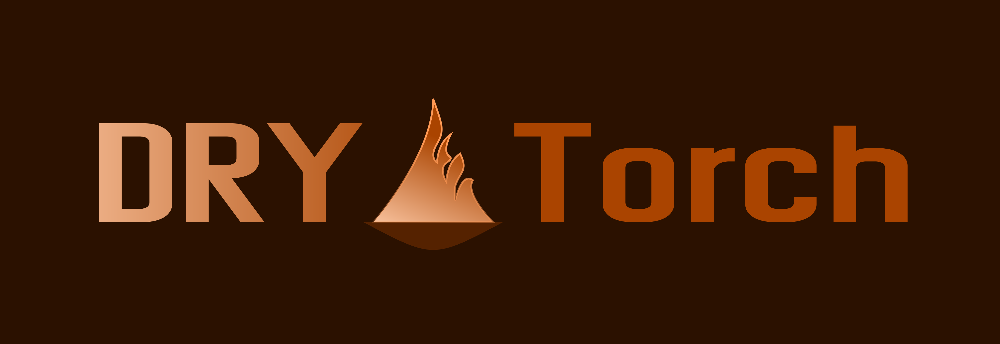

## Don't Repeat Yourself:
- Functionalities for a wide range of machine-learning applications.
- Modularity to build project-specific classes and data types.
- Decoupling external trackers and loggers from the training cycle. 
- Experiment scopes to encourage best practice and avoid data leakage.

### Functionalities:
- Adaptive data loading.
- Metrics with automatic formatting.
- Composable schedulers classes.
- Learning schemes with structured learning rates.
- Automatic metadata extraction.
- Training cycle with hooks.
- Simplified checkpointing.

### Modularity:
- Classes communicate through protocols expressing necessary conditions.
- Classes are built from abstract classes providing an initial implementation.
- Type safety and hints for user data classes thanks to generic annotations.

### Decoupling:
- Event system sends notifications to optional external libraries.
- Already implemented trackers (hydra, wandb, tensorboard, ...).
- Only required dependency: PyTorch and NumPy.

### Design:
- Training and evaluating within an experiment scope.
- Discourage dependencies between experiments.
- Prevent accidentally mixing experiments by passing wrong configuration files.

